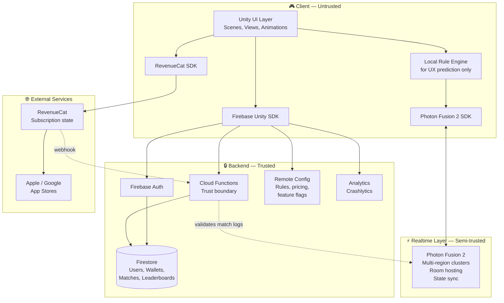
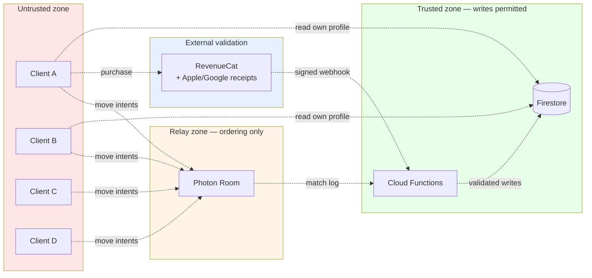
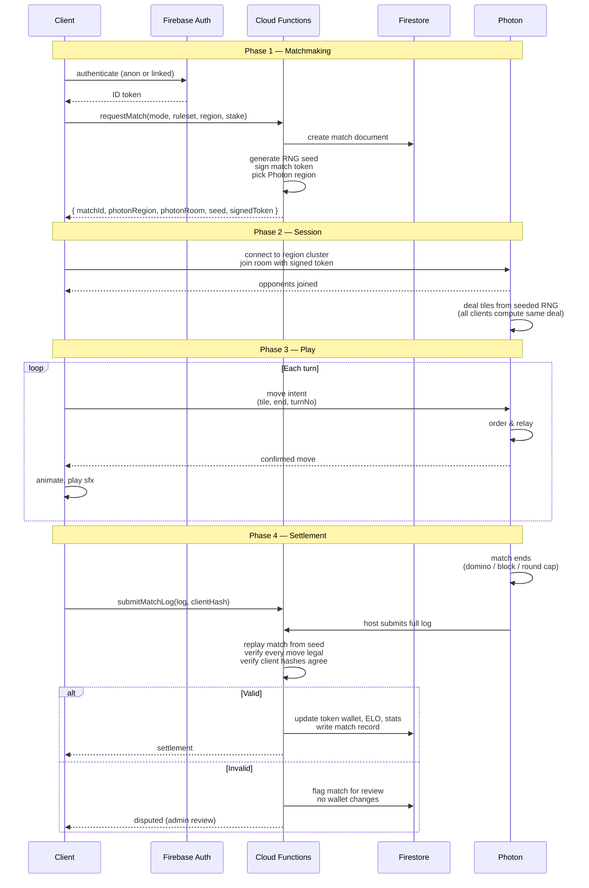
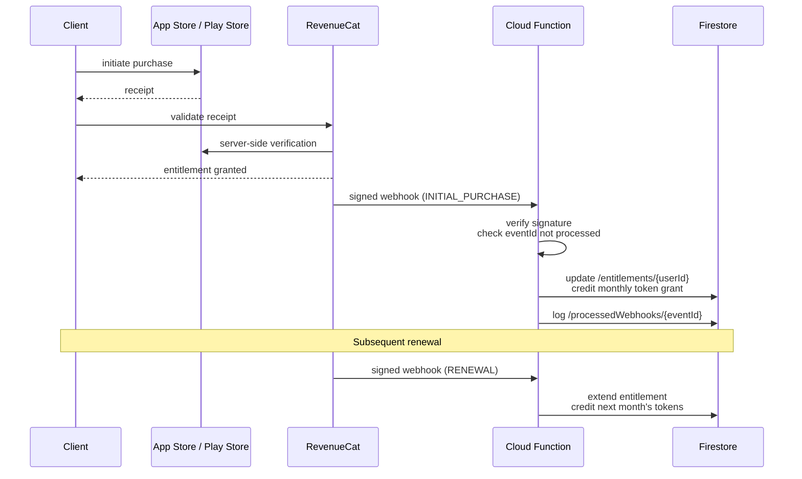

# Pose: Caribbean Dominoes — System Architecture

**Brand mark:** Pose (see [`DECISIONS/0002-product-name.md`](./DECISIONS/0002-product-name.md))
**Author:** Giselle Johnson, INVOVIBE TECH LTD
**Status:** Draft v0.2 — pre-implementation
**Client engine:** Unity 6 LTS (C#)
**Realtime layer:** Photon Fusion 2
**Persistent backend:** Firebase (Auth, Firestore, Cloud Functions, Remote Config)
**Monetization:** Subscription (ad removal + monthly token grant) + IAP token packs
**Audience:** Global from day one, all major rulesets available at launch

---

## 1. Purpose of this document

This document defines the system boundaries, data flows, and trust model for the domino game before any code is written. The core design questions driving every decision below are:

> **"If a malicious client has full control of its own binary, what can it do — and what must it not be able to do?"**
>
> **"How does a player in Kingston get matched fairly with a player in Lagos or Manila without 200ms+ latency feeling broken?"**

The first question shaped the trust model. The second shapes matchmaking, region selection, and how the game *feels* turn-to-turn.

---

## 2. System overview

Three independent systems cooperate. Each has a different trust level and a different failure mode.



**Key principle:** The client is always untrusted. Photon is trusted only to relay and order events — never to validate them. Cloud Functions are the sole writer to anything the player cares about (wallet, ELO, stats, inventory, subscription state).

---

## 3. Component responsibilities

### 3.1 Unity client

The client owns presentation, input, and a *local copy* of the rule engine. The local rule engine exists purely for responsiveness — so the player sees their tile snap into place immediately without waiting for a server round-trip. It is not authoritative for anything.

Specifically, the client:

- Renders the board, hands, chain, scoreboard, avatars, chat
- Handles input (drag tiles, tap dice, emoji reactions)
- Runs animations, sound, haptics, particles
- Predicts the result of the player's own moves for instant feedback
- Sends move *intents* to Photon and waits for confirmation
- Reads cached profile/wallet/match-history data from Firestore
- Reads subscription entitlement from RevenueCat (which mirrors Apple/Google receipts)
- Never writes wallet, ELO, match results, inventory, or subscription state directly

### 3.2 Photon Fusion 2

Photon is the realtime session host. It's responsible for:

- Creating and tearing down match rooms
- Synchronising authoritative game state across 2–4 clients at ~20–60Hz
- Host migration if the current host disconnects
- Lag compensation and client prediction primitives
- Emitting the final match log (an ordered, timestamped event stream) when the match ends

For a global player base, **Photon is configured as multi-region** — see §9 for the region strategy. The client picks the lowest-latency region at launch and matchmaking respects region affinity unless the player opts into global queue.

Photon is *not* responsible for:

- Issuing currency, rewards, or rating changes
- Validating that a move was legal under the game's rules (this is a detection problem, not a prevention problem — see §7)
- Storing anything persistent

### 3.3 Firebase backend

The persistent layer. Each Firebase service has a specific role:

| Service | Role |
|---|---|
| **Auth** | Identity. Anonymous by default, upgradable to Apple/Google/email. |
| **Firestore** | Player profiles, wallets, match history, leaderboards, tournaments, friends. |
| **Cloud Functions** | The *only* component permitted to write sensitive documents. Enforces the trust boundary. Also receives RevenueCat webhooks for subscription state. |
| **Remote Config** | Rule variant definitions, tile set configurations, pricing, feature flags, A/B test buckets. Editable without shipping a new build. |
| **Crashlytics** | Client crash reporting. |
| **Analytics** | Funnel and retention tracking. |
| **Cloud Messaging** | Push notifications (your turn, friend online, tournament starting). |

### 3.4 RevenueCat

Handles the entire subscription + IAP layer. Worth using even though you've shipped Firebase IAP before, because:

- Cross-platform subscription state without writing your own receipt-validation logic
- Server-side webhook on subscription events (renewal, cancel, refund, grace period) sent to your Cloud Functions
- Built-in handling of family sharing, promotional offers, and trial periods
- Free up to $2.5k MTR, then a small revenue share

The client asks RevenueCat *"is this user entitled to no_ads?"* and gets a definitive answer that's already been validated against Apple/Google. Your Cloud Function receives webhooks and writes the entitlement to Firestore for use by other systems (e.g., gifting tokens at the start of each subscription month).

---

## 4. Trust boundaries

There are four trust boundaries in the system. Violating any of them is a security bug.



### Boundary 1: Client → Photon

Assume every client is cheating. Photon will faithfully relay whatever the client sends. This means a modified client can claim to play tiles it doesn't have, or to have drawn from the boneyard when it didn't.

**Defence:** Every move the client sends includes the full intent (tile played, end of chain, player ID, turn number, timestamp). Photon records all of these in order. At match end, the entire log is submitted to a Cloud Function which replays the match from a server-issued RNG seed and verifies every move was legal.

### Boundary 2: Photon → Cloud Function

The match log arrives from the match host. The host could itself be malicious or compromised.

**Defence:** Every participating client also independently submits a hash of the match log. The Cloud Function only accepts results where a majority of clients agree on the log hash. Disagreement flags the match for review and no token changes occur until resolved.

### Boundary 3: Cloud Function → Firestore

This is the only place wallet, stats, ELO, and entitlement writes happen. Firestore security rules deny all client writes to these documents. Clients can only *read* their own data.

### Boundary 4: RevenueCat → Cloud Function

Subscription state arrives via webhook. Webhooks are signed with a shared secret; the Cloud Function verifies the signature before applying any entitlement change. Replay attacks are prevented by checking the event ID against a `processedWebhooks` collection.

---

## 5. Match lifecycle

This is the critical sequence. Every interaction between the systems happens during one of these phases.



### Why a server-issued RNG seed?

If the client generates the tile shuffle, a malicious client can deal itself good tiles. If Photon generates it, a compromised host can do the same. If the Cloud Function issues the seed at match start and every client runs the same deterministic shuffle, the deal is verifiable after the fact — the CF can replay the exact same deal when validating the match log.

---

## 6. Data model

### 6.1 Firestore collections

```
/users/{userId}
    displayName, avatarUrl, countryCode, preferredRuleset,
    preferredRegion, locale, createdAt, linkedProviders[]

/wallets/{userId}
    tokens, lastUpdated
    [write-restricted to Cloud Functions only]

/entitlements/{userId}
    subscriptionTier (free | premium),
    activeUntil, autoRenew, source (apple | google),
    lastWebhookEventId
    [write-restricted; updated only via RevenueCat webhook]

/stats/{userId}
    matchesPlayed, matchesWon, winRate,
    eloByRuleset { jamaicanPartner: 1240, cuban: 1100, ... },
    achievements[], region
    [write-restricted]

/matches/{matchId}
    ruleset, mode (ranked | casual | friend | bot),
    players[], region, status, seed,
    startedAt, endedAt, winnerId, finalScore, logHash
    [write-restricted]

/matchLogs/{matchId}
    events[] — the full ordered move stream
    [write-restricted; retained 90 days for dispute resolution]

/leaderboards/{ruleset}/global/{userId}
    elo, rank, lastMatchAt
/leaderboards/{ruleset}/regional/{regionCode}/{userId}
    elo, rank, lastMatchAt
    [write-restricted]

/tournaments/{tournamentId}
    config, bracket, status, prizePool (in tokens)

/friendships/{userId}/friends/{friendId}
    status, since

/friendInvites/{inviteId}
    fromUserId, toUserId, ruleset, status, expiresAt

/rulesets/{rulesetId}
    displayName, displayNameLocalized {en, es, fr, ...},
    region, tileSet (double-6 | double-9 | double-12),
    startingHand, scoringMode, partnershipRules,
    enabled, sortOrder
    [read-only; managed via admin console + Remote Config]

/processedWebhooks/{eventId}
    source, processedAt
    [internal idempotency tracking]
```

### 6.2 Photon networked state (per match)

```
MatchState
  ├─ turnNumber: int
  ├─ currentPlayerId: string
  ├─ chain: Tile[] (ordered, with orientation)
  ├─ leftEnd: pip value
  ├─ rightEnd: pip value
  ├─ boneyard: Tile[] (face-down, but visible count)
  ├─ hands: Dict<playerId, Tile[]>  // each client only sees their own
  ├─ scores: Dict<teamId, int>
  └─ history: MoveEvent[]
```

Hands are networked such that each client can only see its own — Photon Fusion supports per-peer visibility. This prevents a screen-reader cheat where someone watches opponents' hands.

### 6.3 Match log event schema

```json
{
  "turnNo": 14,
  "playerId": "u_abc123",
  "action": "PLACE" | "DRAW" | "PASS" | "CALL_DOMINO",
  "tile": { "a": 3, "b": 5 },
  "end": "LEFT" | "RIGHT",
  "timestamp": 1745332100123,
  "clientSig": "..."
}
```

Every event is signed by the originating client so logs are attributable even after host migration.

---

## 7. Anti-cheat strategy

Anti-cheat in a turn-based game is fundamentally different from anti-cheat in an action game. You don't need to stop cheating in real time — you need to *detect it reliably after the fact* and make cheating economically pointless.

Because there's no real money at stake, the threat surface is smaller: nobody is laundering through token wins. But ranked ELO and leaderboard placement still create incentive to cheat, and cheating destroys the experience for honest players regardless of payout. The detection layers stay in.

### 7.1 Layered detection

**Layer 1: Deterministic replay.** Every match has a server-issued seed and a complete event log. The Cloud Function replays the match from scratch and verifies every move was legal. Any impossible move (e.g., a tile the player couldn't have had) invalidates the match.

**Layer 2: Hash consensus.** Every client submits a hash of the match log independently. Disagreement = dispute = no ELO change until resolved.

**Layer 3: Statistical monitoring.** A background job aggregates player stats looking for anomalies: win rates above 70% over 500+ games, impossible tile-distribution luck, turn times suspiciously consistent, etc. Flagged accounts are shadow-banned (still play, but only against other flagged accounts).

**Layer 4: Social signals.** In-match reporting, friend-only matches/tournaments, verified accounts for tournament play.

### 7.2 Rule engine in two places

The rule engine — what tiles are legal to play, when a player must draw, how scoring works — lives in two places:

- **Client (C#):** For UX. Shows legal moves, highlights valid chain ends, shows "must draw" state. Never authoritative.
- **Cloud Function (TypeScript):** For validation. Replays the log and checks every move against the same rules.

**These must stay in sync.** The ruleset definitions live in Firestore (`/rulesets/{rulesetId}`) as data, not code — both the Unity client and the Cloud Function read from the same source of truth. Adding new variants becomes a config change, not a deploy.

A shared TypeScript-to-C# code-gen step or a hand-maintained pair of identical implementations with cross-validation tests is the safest pattern. Recommendation: write the canonical rule engine in TypeScript first (cheaper to test), then port carefully to C# with a shared test corpus of replay logs that both implementations must agree on.

---

## 8. Game modes & rule variants (global from day one)

The product supports four match modes:

| Mode | Description | ELO impact | Tokens |
|---|---|---|---|
| **Ranked** | Random global matchmaking, region-preferred | Yes | Entry fee + reward |
| **Casual** | Random matchmaking, no ELO | No | Small reward |
| **Friend** | Private room, share invite link | No | None |
| **Bot** | Vs AI, offline-capable | No | Small reward, capped daily |

### 8.1 Ruleset coverage at launch

All variants ship enabled at launch, surfaced through a ruleset picker rather than locked behind progression. The Caribbean variants are the marketing centrepiece, but the broader catalogue ensures matchmaking density everywhere in the world.

| Variant | Tile set | Players | Scoring | Primary regions |
|---|---|---|---|---|
| Jamaican Partner | Double-6 | 4 (2 teams) | Pips of losers; "6-love" | 🇯🇲 🇰🇾 🇧🇸 🇹🇨 |
| Jamaican Cut-throat | Double-6 | 2–4 | Individual | 🇯🇲 🇰🇾 |
| Trinidadian | Double-6 | 4 (2 teams) | Partner play | 🇹🇹 🇧🇧 🇬🇩 |
| Cuban | Double-9 | 4 (2 teams) | 150-point target | 🇨🇺 🇩🇴 🇵🇷 |
| Puerto Rican | Double-6 | 4 (2 teams) | First to 200, capicú bonus | 🇵🇷 |
| Mexican Train | Double-9 or 12 | 2–8 | Lowest pips wins | 🇲🇽 🇺🇸 |
| Block / Draw (Anglo) | Double-6 | 2–4 | Standard | 🇺🇸 🇬🇧 |
| All Fives (Muggins) | Double-6 | 2–4 | Multiples of 5 | 🇺🇸 🇬🇧 |
| Latin / Domino Latino | Double-6 | 4 (2 teams) | First to 100/200 | 🌎 LatAm general |
| Bergen | Double-6 | 2–4 | Match-end bonuses | 🇪🇺 |
| Matador | Double-6 | 2–4 | Sum-to-7 placement | 🇪🇺 |

The `rulesets` Firestore collection holds these as data. Adding a new variant is:

1. Define the ruleset document (rules + localized strings)
2. Add a UI tile/board skin if needed
3. Add validator logic to the rule engine if the variant uses a mechanic not yet covered
4. Both client and validator pick it up

Most variants share a small set of primitives (tile placement validation, draw vs pass rules, scoring at end-of-round, partnership accounting). Designing the rule engine around those primitives — not around individual variant names — is what keeps adding new ones cheap.

### 8.2 Localization

Global from day one means launch-day support for at least:

- English (en)
- Spanish (es) — critical for LatAm rulesets
- French (fr) — critical for Haiti, French Caribbean, Africa
- Portuguese (pt) — Brazil
- Haitian Creole (ht) — high-value Caribbean market
- Hindi (hi) — large dominoes-playing population

Use Unity's Localization package + remote string tables in Firestore so translations can be added without a binary release.

---

## 9. Global infrastructure & matchmaking

### 9.1 Photon multi-region setup

Photon Fusion supports multiple region clusters. For a global launch, configure at minimum:

| Region | Photon code | Primary audience |
|---|---|---|
| US East | `us` | North America East, Caribbean, LatAm North |
| US West | `usw` | North America West |
| South America | `sa` | Brazil, Argentina, Chile |
| Europe | `eu` | Europe, North Africa |
| Asia | `asia` | India, Southeast Asia |
| Japan | `jp` | Japan, Korea |
| South Africa | `za` | Sub-Saharan Africa |

The client runs a ping test to all available regions on launch and stores the lowest-latency three. Matchmaking prefers same-region matches; if no opponent is found within `N` seconds (configurable via Remote Config — start at 8s for ranked, 4s for casual), it expands to the nearest neighbour region, then to global.

### 9.2 Matchmaking strategy

Matchmaking lives in a Cloud Function with a Firestore-backed queue:

```
/matchmakingQueue/{queueId}
    userId, ruleset, mode, region, eloAtRequest,
    requestedAt, expandedToNeighbours: bool, status
```

A scheduled function (every 2s) pairs queued players by:

1. Same ruleset, same mode (always)
2. Same region preferred; widen after `N` seconds
3. ELO band ±100 initially; widens by ±50 every 5 seconds
4. Bot fallback after 30 seconds of no human match (casual/ranked configurable; for friend mode, no bot fallback)

This is intentionally simple — Glicko-2 style proper matchmaking with bot ladders comes in v2. Cold-start matchmaking density is the hardest problem in launching globally, and bot fallback is what keeps the experience from being broken on day one.

### 9.3 Regions for Firebase

Firestore primary region: **`nam5`** (multi-region US, optimised for low-latency global reads with regional caching). Cloud Functions deployed to **`us-central1`**, **`europe-west1`**, and **`asia-northeast1`** for low-latency RPCs from each major region.

### 9.4 Expected load

For a global launch with conservative ramp (target: 100k MAU in year one, 10k DAU peak):

- **Photon:** 10k DAU × 4 avg matches/session × 8 min/match = ~2,000 concurrent peak across all regions. Budget Photon **Gaming Plus plan (~$95/mo per 500 CCU)**, scaled to ~$400–500/mo at this volume.
- **Cloud Functions:** ~30k match settlements/day at ~300ms each, plus ~50k matchmaking ticks. ~$50–150/mo.
- **Firestore:** Reads dominate. Aggressive client-side caching for leaderboards and profile data. Expect $300–800/mo at this scale.
- **RevenueCat:** Free up to $2.5k MTR. Above that, 1% of tracked revenue.
- **Cloud Messaging:** Free at any relevant scale.

Total infra cost target: **under $2k/month at 100k MAU**, well below the subscription/IAP revenue at any reasonable conversion rate (>1% conversion at $4.99/mo = $5k+ MRR).

### 9.5 Environments

**Single Firebase project, promoted from staging to prod.** One project (`carib-domino`) carries the app from solo development through soft launch into production. Earlier drafts of this document called for a three-project (dev/staging/prod) split — that was reversed in [`docs/DECISIONS/0004-single-firebase-project.md`](DECISIONS/0004-single-firebase-project.md). The single-project pattern matches the founder's prior shipping experience, removes per-environment configuration drift, and keeps the operational footprint small while pre-launch.

Stage gating happens *inside* the one project rather than across multiple projects:

- **Pre-soft-launch:** Firestore rules permissive enough for dev workflows; Cloud Functions deployed without staged rollouts; Remote Config populated with dev defaults.
- **Soft launch (M9):** Cloud Functions move to staged rollouts (10% → 50% → 100%); Remote Config gates new features behind audience flags; Firestore rules tighten for production-shaped data.
- **Global launch (M10):** Same project, full rollouts, Remote Config audience gates retired or scoped to A/B tests.

Photon and RevenueCat similarly use one app/project each, configured the same way across environments. Unity build variants (development / release) toggle the Firebase analytics namespace and the Photon log level, but both point at the same Firebase project and the same Photon AppID. If a true second environment is ever required (for example, a public open beta running in parallel to a private alpha), revisit ADR 0004 — re-introducing a `staging-carib-domino` project at that point is straightforward thanks to the `.firebaserc` alias structure.

---

## 10. Monetization

### 10.1 Products

| Product | Price (illustrative) | Entitlement |
|---|---|---|
| Premium subscription (monthly) | $4.99/mo | Ad removal + 5,000 tokens/month auto-grant + exclusive tile/board skins + 2× daily bonus |
| Premium subscription (yearly) | $39.99/yr | Same, ~33% discount |
| Token pack — small | $1.99 | 2,500 tokens |
| Token pack — medium | $4.99 | 7,500 tokens (best starter value) |
| Token pack — large | $19.99 | 35,000 tokens |
| Token pack — mega | $49.99 | 100,000 tokens |

All consumable token packs are one-time IAPs. The subscription is the primary monetization driver and ad replacement.

### 10.2 Token economy principles

- **Tokens are not money.** They are explicitly described as "play coins" in store listings, terms, and UI. No withdrawal, no transfer between users, no real-world redemption — this keeps the product clearly outside gambling regulation in every jurisdiction.
- **Free players are sustainable.** Daily bonus + ad-watch-for-tokens + bot-mode rewards mean a free player can always play. Tokens accelerate, they don't gate.
- **Match entry fees scale with stakes.** Casual: 50 tokens entry, 90-token reward. Ranked: variable by ELO bracket. Bot: 0 entry, small reward.
- **Anti-grinding caps.** Daily reward caps in bot mode prevent farming.

### 10.3 Ads

For free users only. Use **Google AdMob** with **LevelPlay (IronSource) mediation** for fill-rate optimization. Ad placements:

- Interstitial after every 3rd match (ranked excluded — never break a ranked match)
- Rewarded video for "double your match reward" or "extra daily bonus"
- Banner in lobby only (never during matches)

Subscription removes all ad placements except optional rewarded videos (which the player chooses to watch for benefit).

### 10.4 RevenueCat → Cloud Function flow



---

## 11. Open questions to resolve before build

Decisions that affect schema or UX and should be made early.

1. **Spectator mode?** Adds a separate Photon subscription role and affects networked-state visibility. Easier to design in from day one than to retrofit. Recommendation: out of MVP, in v2.

2. **Replay viewing.** Match logs are already stored. Replay playback is a cheap feature with high perceived value. Recommendation: ship in v1.1 — internal tool first, public feature later.

3. **Tournament architecture.** Single-elimination brackets are simple. Swiss pairings, leagues, and seasonal ladders need a more complex scheduler. Recommendation: defer to v2.

4. **Friend system depth.** Just direct invites, or full social graph with feeds? Recommendation: invites + friends list in v1, no feed.

5. **Cross-platform progression.** Auth-linked accounts already give this for free, but it needs explicit UX (the "link your account" prompt for anonymous users). Recommendation: prompt after match #5 and after first IAP attempt.

6. **Chat moderation.** In-match chat needs profanity filtering (per-locale) and reporting. Firebase has no built-in. Recommendation: **disable free-text chat at launch**, ship with quick-emote / canned-phrase chat only. This eliminates the moderation burden entirely while preserving the social feel that makes Ludo Club work. Free-text chat can come later with proper moderation infrastructure (Perspective API or third-party).

7. **GDPR / data retention.** Required for EU users from day one. Recommendation: 90-day match log retention, indefinite profile data with user-initiated deletion endpoint, standard cookie/consent flow on first launch.

8. **Age gating.** Subscription IAP and chat make 13+ a sensible floor. Recommendation: birthdate prompt on first launch, store as age band only.

---

## 12. Recommended first implementation milestones

1. **M1 — Single-player offline prototype.** Unity + local rule engine, two rulesets (Jamaican partner + Block) vs 3 bots. No backend. Proves the UX, the rule engine architecture, and the bot AI.
2. **M2 — Firebase integration.** Auth, profiles, stats. Still single-player, but results persist. Localization scaffold in place.
3. **M3 — Photon 2-player online (single region).** One ruleset, basic matchmaking, no entry fee. Validates the trust boundary architecture.
4. **M4 — Settlement pipeline.** Cloud Function match validation, token wallet, virtual currency. This is where the trust boundary becomes real.
5. **M5 — Multi-region Photon + matchmaking expansion.** Region detection, queue, ELO bands, bot fallback.
6. **M6 — All rulesets shipped.** Full ruleset catalogue, ruleset picker, regional surfacing.
7. **M7 — Monetization.** RevenueCat integration, subscription flow, token packs, ads (free tier), webhook pipeline.
8. **M8 — Polish pass.** Animations, sound, haptics, avatars, emotes, daily bonus loop, achievements.
9. **M9 — Soft launch.** Release in Cayman + Jamaica only initially, iterate on retention metrics for ~4 weeks.
10. **M10 — Global launch.** All regions, all rulesets, full marketing push.

Each milestone is independently shippable (even if only internally) and has a clear definition of done. Realistic timeline for a solo full-stack engineer with AI assistance and prior Firebase + React Native experience: M1–M4 in **~8–10 weeks**, M5–M7 in **~6–8 weeks**, M8–M10 in **~6 weeks**. Total to global launch: **~5–6 months of focused work**, faster if any of it can be parallelised.

---

*Document ends. Next artifact should be the detailed Firestore security rules and the Cloud Function interface specs.*
